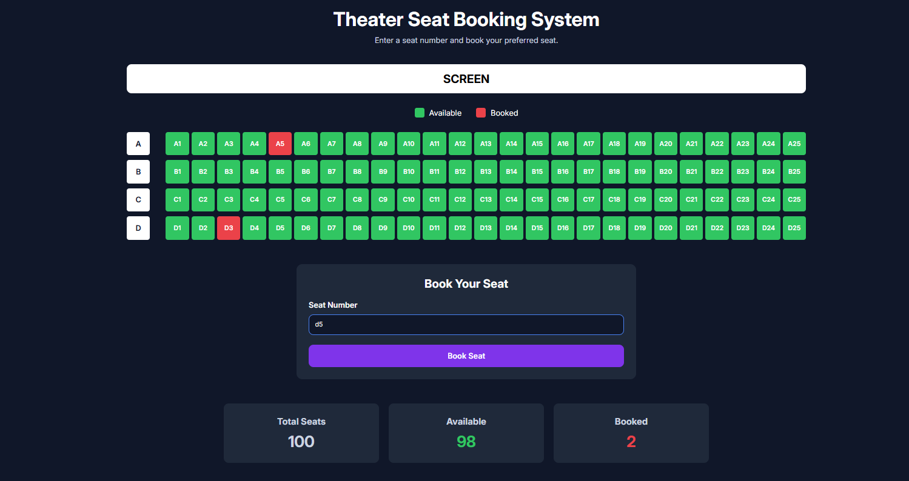

## Preview



# Theater Seat Booking System

A simple theater seat booking system built with HTML, CSS, and Vanilla JavaScript.

## Features

- Generate 100 theater seats dynamically
- Book seats using seat number input
- Prevent duplicate bookings
- Save booked seats using Local Storage
- Automatically restore booked seats after page refresh
- Display total, available, and booked seat statistics
- Responsive design for desktop and mobile devices

## Technologies Used

- HTML5
- CSS3
- JavaScript (Vanilla JS)
- Local Storage

## Live Demo

Github: https://tawhidzihad.github.io/theater-seat-booking-system/

Netlify: https://theater-seat-booking-system.netlify.app/

## Run Locally

1. Clone the repository

```bash
git clone https://github.com/tawhidzihad/theater-seat-booking-system.git
```

2. Open the project folder

```bash
cd theater-seat-booking-system
```

3. Open `index.html` in your browser

## Author

Md Tawhidul Islam Zihad
